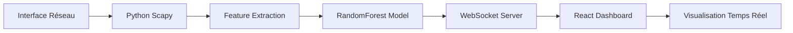

# Architecture Sentinel IDS - Capture de Paquets en Temps Réel

## Vue d'ensemble

Sentinel IDS implémente une architecture complète de détection d'intrusions basée sur l'intelligence artificielle, avec capture de paquets réseau en temps réel et analyse par modèle RandomForest.



## Composants Principaux

### 1. Capture de Paquets (Python Backend)

**Localisation** : `/python-backend/`

**Technologies** :
- **Scapy** : Capture de paquets au niveau réseau
- **WebSockets** : Communication temps réel avec le frontend
- **Scikit-learn** : Modèle RandomForest pour la détection d'anomalies
- **AsyncIO** : Gestion asynchrone des connexions

**Fonctionnalités** :
- Capture de paquets sur interfaces réseau spécifiques
- Extraction des 41 caractéristiques KDD Cup 99
- Prédiction d'anomalies avec modèle RandomForest
- Diffusion temps réel via WebSocket

**Points d'entrée** :
- `sentinel_capture.py` : Service principal
- `start_sentinel.py` : Script de démarrage simplifié

### 2. Dashboard Web (React Frontend)

**Localisation** : `/components/pages/LiveTrafficPage.tsx`

**Technologies** :
- **React** + **TypeScript** : Interface utilisateur
- **WebSocket API** : Connexion temps réel au backend
- **Recharts** : Visualisation des données
- **Tailwind CSS** : Design system

**Fonctionnalités** :
- Connexion/déconnexion au service Python
- Configuration de la capture (interface, filtres)
- Visualisation temps réel des paquets
- Analyse détaillée des caractéristiques ML
- Graphiques et statistiques en direct

## Flux de Données

### 1. Capture et Extraction

```python
# 1. Capture avec Scapy
packet = sniff(iface="eth0", filter="net 192.168.0.0/16")

# 2. Extraction des caractéristiques
features = {
    'duration': packet_duration,
    'src_bytes': len(packet),
    'dst_bytes': response_size,
    'count': connection_count,
    'serror_rate': error_rate,
    # ... 36 autres caractéristiques
}

# 3. Prédiction RandomForest
prediction = model.predict([features])
anomaly_score = model.predict_proba([features])[0][1]
```

### 2. Communication WebSocket

```typescript
// Frontend → Backend
{
  "type": "start_capture",
  "interface": "eth0",
  "filter": "net 192.168.0.0/16"
}

// Backend → Frontend
{
  "type": "packet",
  "data": {
    "id": "pkt_123",
    "timestamp": "2024-01-01T12:00:00Z",
    "sourceIp": "192.168.1.100",
    "prediction": "Anomalie",
    "anomaly_score": 0.85,
    "features": { ... }
  }
}
```

### 3. Affichage Temps Réel

```typescript
// Hook React pour la gestion des paquets
const { packets, stats, startCapture } = useRealPacketCapture();

// Mise à jour automatique de l'interface
useEffect(() => {
  // Nouveau paquet → Mise à jour de la liste
  // Calcul des statistiques → Mise à jour des graphiques
}, [packets]);
```

## Intégration du Modèle RandomForest

### Caractéristiques Extraites (41 features)

Le système extrait automatiquement les caractéristiques standard du dataset KDD Cup 99 :

#### Connexion de Base (9)
- `duration` : Durée de la connexion
- `src_bytes` : Octets envoyés par la source
- `dst_bytes` : Octets envoyés vers la destination
- `land` : 1 si source = destination, 0 sinon
- `wrong_fragment` : Nombre de fragments erronés
- `urgent` : Nombre de paquets urgents
- `hot` : Nombre d'indicateurs "hot"
- `num_failed_logins` : Tentatives de connexion échouées
- `logged_in` : 1 si connexion réussie, 0 sinon

#### Contenu (13)
- `num_compromised` : Nombre de conditions compromises
- `root_shell` : 1 si accès root obtenu, 0 sinon
- `su_attempted` : 1 si commande su tentée, 0 sinon
- `num_root` : Nombre d'accès root
- `num_file_creations` : Opérations de création de fichiers
- `num_shells` : Nombre de shells prompts
- `num_access_files` : Opérations d'accès aux fichiers
- `num_outbound_cmds` : Commandes sortantes dans une session FTP
- `is_host_login` : 1 si connexion host login, 0 sinon
- `is_guest_login` : 1 si connexion guest login, 0 sinon

#### Trafic Temporel (9)
- `count` : Connexions vers le même hôte (dernières 2 sec)
- `srv_count` : Connexions vers le même service (dernières 2 sec)
- `serror_rate` : % d'erreurs de connexion
- `srv_serror_rate` : % d'erreurs de connexion vers le même service
- `rerror_rate` : % d'erreurs REJ
- `srv_rerror_rate` : % d'erreurs REJ vers le même service
- `same_srv_rate` : % de connexions vers le même service
- `diff_srv_rate` : % de connexions vers différents services
- `srv_diff_host_rate` : % de connexions vers différents hôtes

#### Hôte de Destination (10)
- `dst_host_count` : Connexions vers le même hôte destination
- `dst_host_srv_count` : Connexions vers le même service de l'hôte
- `dst_host_same_srv_rate` : % même service vers l'hôte destination
- `dst_host_diff_srv_rate` : % services différents vers l'hôte
- `dst_host_same_src_port_rate` : % même port source vers l'hôte
- `dst_host_srv_diff_host_rate` : % hôtes différents pour le service
- `dst_host_serror_rate` : % erreurs de connexion vers l'hôte
- `dst_host_srv_serror_rate` : % erreurs de service vers l'hôte
- `dst_host_rerror_rate` : % erreurs REJ vers l'hôte
- `dst_host_srv_rerror_rate` : % erreurs REJ de service vers l'hôte

### Format du Modèle

Votre modèle RandomForest doit :
1. Accepter un vecteur de 41 caractéristiques numériques
2. Retourner une prédiction binaire (0=Normal, 1=Anomalie)
3. Supporter `predict_proba()` pour le score de confiance

```python
# Exemple d'utilisation
features_vector = np.array([[0.1, 1460, 0, 0, ...]])  # 41 features
prediction = model.predict(features_vector)[0]         # 0 ou 1
confidence = model.predict_proba(features_vector)[0][1] # Score 0-1
```

## Configuration et Déploiement

### 1. Variables d'Environnement

```bash
# Service WebSocket
SENTINEL_HOST=localhost
SENTINEL_PORT=8765

# Modèle ML
SENTINEL_MODEL_PATH=models/random_forest_model.pkl

# Capture réseau
SENTINEL_INTERFACE=eth0
SENTINEL_FILTER=net 192.168.0.0/16

# Performance
SENTINEL_MAX_PACKET_QUEUE=1000
SENTINEL_LOG_LEVEL=INFO
```

### 2. Sécurité

**Privilèges requis** :
- Capture de paquets : privilèges administrateur
- Accès réseau : lecture des interfaces réseau
- Fichiers : lecture du modèle ML

**Filtrage** :
- Utilisation de Berkeley Packet Filter (BPF)
- Limitation aux réseaux privés par défaut
- Exclusion du trafic de loopback

### 3. Performance

**Optimisations** :
- Filtrage BPF au niveau kernel
- Queue asynchrone pour les paquets
- Batch processing pour les prédictions ML
- WebSocket avec compression

**Monitoring** :
- Logs détaillés des performances
- Statistiques temps réel (paquets/seconde)
- Métriques de la queue de traitement

## Points d'Extension

### 1. Nouveaux Modèles ML

```python
# Interface pour nouveaux modèles
class ModelInterface:
    def predict(self, features: np.ndarray) -> int:
        pass
    
    def predict_proba(self, features: np.ndarray) -> np.ndarray:
        pass
```

### 2. Nouvelles Caractéristiques

```python
# Extension de l'extracteur de caractéristiques
def extract_custom_features(self, packet):
    features = self.extract_features(packet)  # Features de base
    features.update({
        'custom_feature_1': self.calculate_custom_1(packet),
        'custom_feature_2': self.calculate_custom_2(packet),
    })
    return features
```

### 3. Nouveaux Protocoles

```python
# Support de nouveaux protocoles
def _get_protocol_specific_features(self, packet):
    if DNS in packet:
        return self._extract_dns_features(packet)
    elif HTTP in packet:
        return self._extract_http_features(packet)
    # ... autres protocoles
```

## Troubleshooting

### Problèmes Courants

1. **Permission Denied** : Vérifiez les privilèges administrateur
2. **No packets captured** : Vérifiez l'interface et les filtres
3. **WebSocket connection failed** : Vérifiez le port et le firewall
4. **Model loading error** : Vérifiez le chemin et le format du modèle

### Debug Mode

```bash
# Activation du debug
SENTINEL_LOG_LEVEL=DEBUG python3 sentinel_capture.py

# Logs détaillés
tail -f sentinel_capture.log | grep DEBUG
```

### Tests de Connectivité

```bash
# Test WebSocket
python3 -c "import websockets; print('WebSocket support OK')"

# Test capture
sudo python3 -c "from scapy.all import sniff; print('Scapy OK')"

# Test modèle
python3 -c "import sklearn; print('Scikit-learn OK')"
```

## Roadmap

### Phase 1 : Implémentation de Base ✅
- Capture de paquets avec Scapy
- Extraction des caractéristiques KDD Cup 99
- Intégration RandomForest
- Interface WebSocket
- Dashboard React

### Phase 2 : Optimisations 🔄
- Performance et scalabilité
- Support multi-interfaces
- Compression des données
- Cache des prédictions

### Phase 3 : Extensions 📋
- Support de nouveaux modèles ML
- Détection de patterns complexes
- Intégration avec SIEM
- API REST pour l'intégration

Cette architecture fournit une base solide pour un système IDS moderne, avec la flexibilité d'intégrer votre modèle RandomForest existant et d'étendre les fonctionnalités selon vos besoins spécifiques.